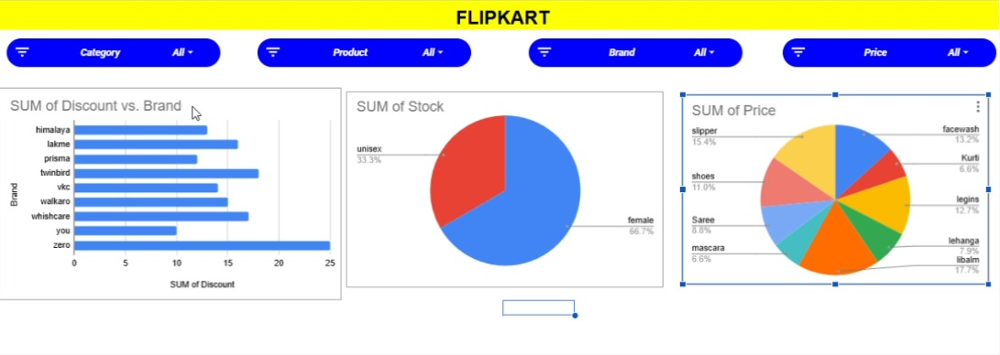

. Flipkart Sales Dashboard

. Dashboard preview

 .Project Overview
This project is an interactive Flipkart Sales Dashboard created using Microsoft Excel. It helps analyze sales performance, brand discounts, stock distribution, and product pricing through interactive charts and visualizations.
. Features
.Sales Dashboard
.Discount Analysis by Brand
.Stock Distribution Analysis
.Price Distribution by Product
.Overall Sales Insights
.Brand-wise Performance
.Product Category Analysis
.Interactive Filters (Category, Product, Brand, Price)
.Tools Used
.Microsoft Excel
.Pivot Tables
.Pivot Charts
.Slicers
.Data Cleaning
.Author
SOBIA.R
